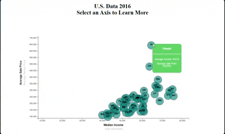

<strong>Warehousing the Housing Crisis</strong>

 

Homelessness is something that many people witness but very few are willing to talk about. Even in mainstream media, homeless people are either vilified or glorified. But very few tackle how it really is to become homeless.
In truth, homelessness is a perpetual shame of humanity. It’s a tragedy that there are people who own so many houses they have to hire someone to keep track of it for them. And yet, some people have to sleep on the sidewalk because they can’t afford rent.
Unfortunately, not a lot of people realize this. The common notion is that homelessness is somewhat a choice. That the homeless deserve what they are going through because they didn’t study hard or look for a job. But no, it isn’t like that at all.

 

<i>Judy Ponio ~ https://ofhsoupkitchen.org/quotes-that-will-open-your-eyes-about-homeless</i>

What if the solution were that simple though? What if by merely spreading awareness we could solve the widespread problems we see every time we drive into town? Not through donations but through actions. Not by emptying our pockets, but by preventing the systemic abbolition of affordable housing fueled by Capitalistic supply and demand. Personally, I don't recall asking for higher rent and abysmal mortgage payments. 

 

Using data gathered from the US Census Bureau, HUD, and data scraped from Zillow, Trulia, and various rental forums, we have constructed multiple interactive dashboards that allow users to see the regrettable gap in affordable housing available in their state. 

Users can filter by average income and see how it compares to the average sale price of a home, which can then be used to calculate the average mortgage and rental prices to let visitors of the site determine for themselves whether the high rate of homelessness is related or unrelated to the cost of living.

